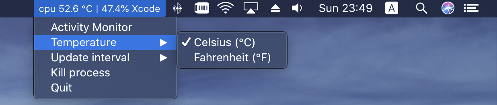
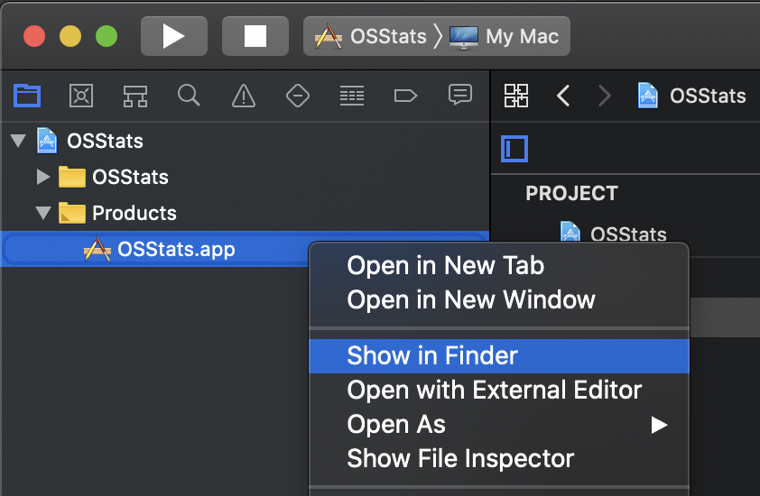
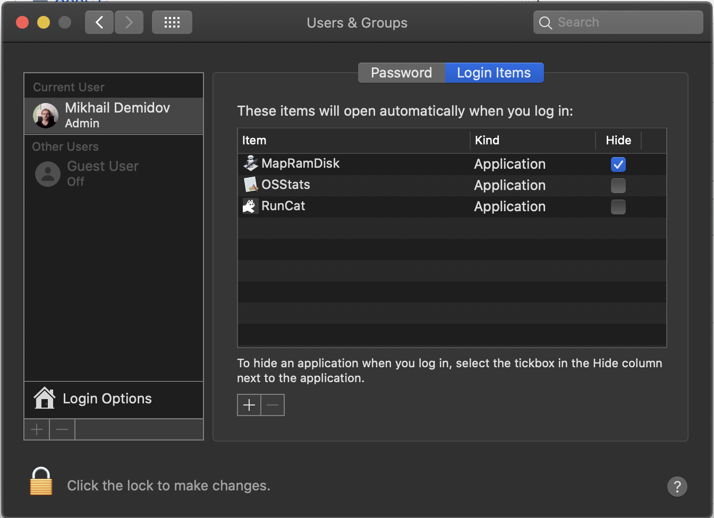

# MacOS CPU Status

Just simple application that shows the most cpu consumable process in the system.

- info shown in system status bar
- info update interval is 5 seconds

## Why ?

Sometimes strange system processes eat a lot cpu power, for example **photoanalysisd**. To not spend time to open system Activity Monitor application to check what is going on, now it is just a brief look at system status bar.

## Build from Xcode

Just clone this repo and build the app. Then move app bundle to */Application* directory. 

## Manually

Unpack **Release.zip** and move app bundle to */Application* directory. Then in *System Preferences -> General* allow the app to run from untrusted developer.

## Launch on Login

- You can do autolaunch of this app at login time via *System Preferences*.

